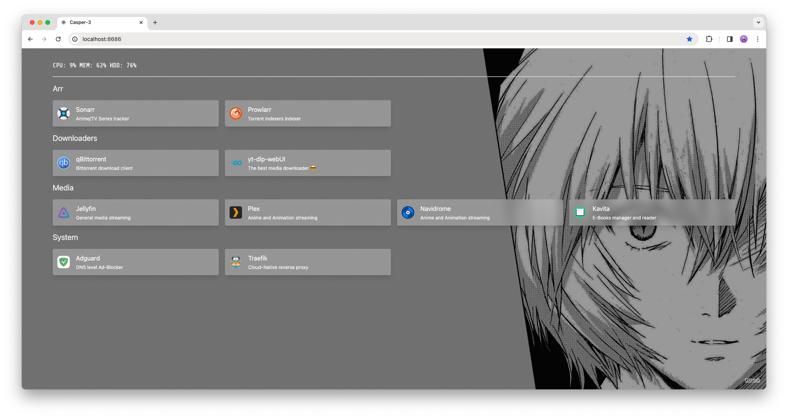

# Rei

A work-in-progress alternative to [homepage](https://github.com/gethomepage/homepage).

Written in Go instead of extrabloated Next.js, extra-light on system-resources. Truly static.



## Configurable

Easy configuration, just a YAML file

Create a file named `config.yml`

Example:
```yaml
---
port: 8686
servername: Casper
authentication: false

wallpaper: /images/wallpaper.avif
opacity: 0.399

services:
  Section1: 
    - name: Jellyfin
      url: https://...
      icon: jellyfin.svg
      description: ...
    - name: Plex
      url: ...
      icon: plex.svg
      description: ...
  Section2: 
    - name: ...
      url: ...
      icon: ....svg
      description: ...
```

## Docker
```sh
docker run -d -p 8686:8686 --name rei -v .config/rei:/config -v .data/rei:/images ghcr.io/marcopeocchi/rei:latest
```

## Docker Compose
```yaml
services:
  rei:
      image: ghcr.io/marcopeocchi/rei:latest
      container_name: rei
      restart: unless-stopped
      volumes:
        - /home/user/.config/rei:/config
        - /home/user/.data/rei:/images
      ports:
        - 8686:8686
```

## Docker Compose with Traefik
```yaml
services:
  rei:
      image: ghcr.io/marcopeocchi/rei:latest
      container_name: rei
      restart: unless-stopped
      volumes:
        - /home/marco/.config/rei:/config
      labels:
        - "traefik.http.routers.homepage.rule=Host(`rei.domain.xyz`)"
        - "traefik.http.routers.homepage.entrypoints=https" # may vary with your config
        - "traefik.http.routers.homepage.tls=true"
        - "traefik.http.routers.homepage.tls.certresolver=dns" # may vary with your config
```

### Systemd configuration

```sh
nano /etc/systemd/system/rei.service
```

```
[Unit]
Description=Rei dashboard
After=network.target

[Service]
User=YOUR_USER
ExecStart=/usr/bin/rei -c /etc/rei/config.yml

[Install]
WantedBy=multi-user.target
```

```
systemctl enable rei
systemctl start rei
```

## Considerations

Only for **Linux** atm.

## Themable

By mouting the `/images` volume you can access your saved images to use as wallpaper :)
